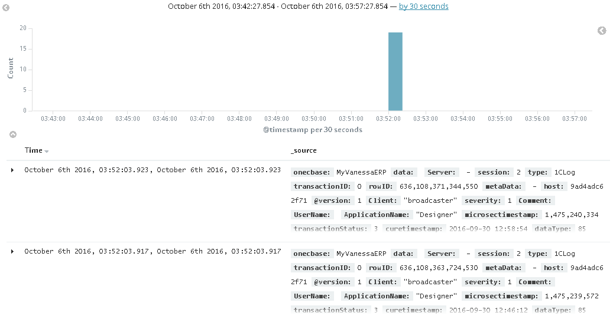

# LogStash Input Plugin for 1C Application Logs

* use logstash to collect metrix from sqlite format of application logs in [1C:Enterprise Platform](http://1c-dn.com/1c_enterprise/what_is_1c_enterprise/) 

## Installation

you need

* install LogStash
* get the plugin from release page [current release is 0.1.4](https://github.com/silverbulleters-research/logstash-vanessa-sqlitelogs/releases/download/0.1.4/logstash-input-sqliteonec-0.1.4.gem)
* run `logstash-plugin install /srv/logstash-input-sqliteonec-0.1.4.gem`

## Input Config

* create your logstash config file with `input`, `filter` and `output` section

example input section looks like:

```
input {

    sqliteonec {
		type => "1CLog"
		path_since => "IncrementalInputTable" # table name to create last read records
		onec_base_name => "MyVanessaERP" # human readable base name
		onec_base_guid => "9c1205e0-595b-4edd-9f70-6dda09b6f888" # guid of database (get from the 1CV8Clst.lst file)
		onec_server_reg_path => "C:\srvinfo\reg_1541" # cluster server files path
    }

}
```

* run `logstash -f your-config-file.conf` and go to the kibana dashboards - you will see your logs



## Contribute

* intall JDK
* install jruby
* `git clone` this repo
  * `git remote add myfork` with your fork
* run `gem install bunder && bundle install
* write specs with RSspec (or cucumber)
* read [this doc](https://www.elastic.co/guide/en/logstash/5.0/_how_to_write_a_logstash_input_plugin.html#_how_to_write_a_logstash_input_plugin)
* impove plugin with your code
* run `bundle exec rspec spec`
* run `bundle exec cucumber`
* use `docker-run50-uat.sh` for final checks (or `docker-run50-uat.cmd` on Windows 10 with docker HyperV support)
  * if there is a error - run `docker-logstash-only` for debug and fix
* try to see `http://localhost:5601` - you will see kibana with two demo 1C Application Journal
* if all is correct pull-request your changes ;-). Be social !!!

## Why in English and not in Russia

* let it be 1C World !!!

but there is a [simple Russian readme](./docs/README_RU.md) in `docs` dir
